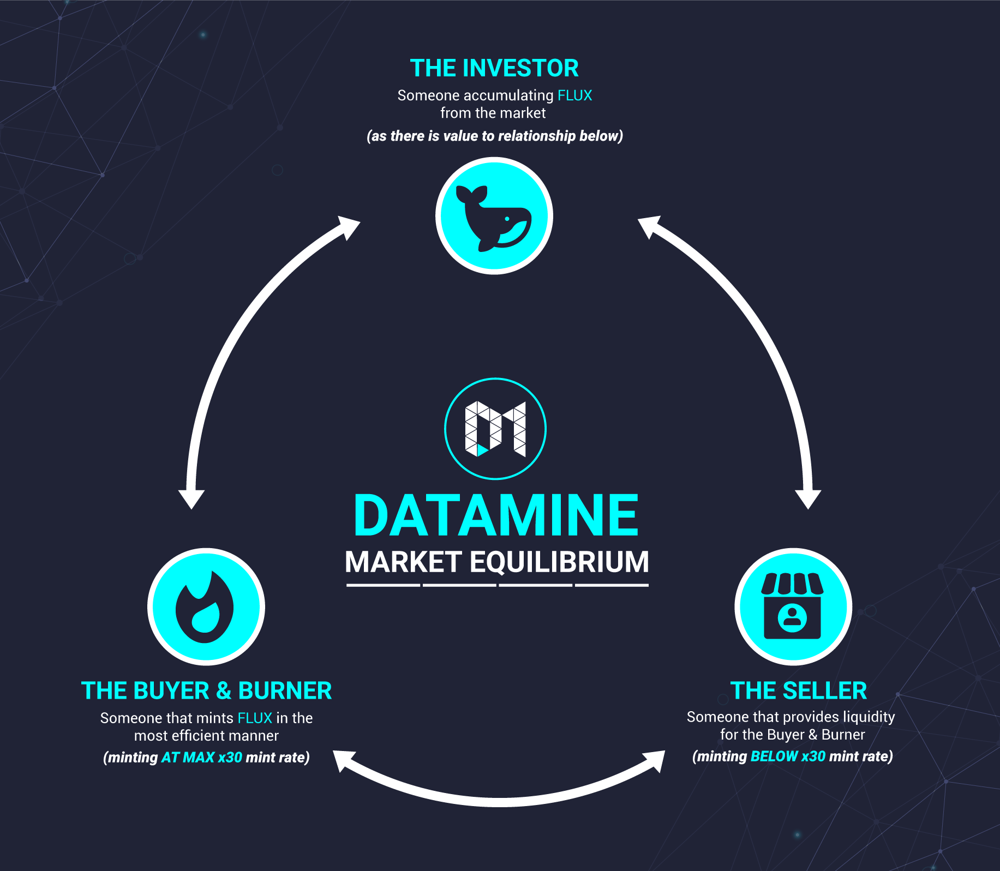

# What global problem are we trying to fix?

Datamine Ecosystem aims to solve one of the biggest economic problems: **Inflation**. DAM & FLUX tokens aim to be deflationary **base currencies of DeFi** hooking into other DeFi projects.

Due to advancements in Smart Contract technnology we've created a currency that can be used as it's own product to create 24/7 global market demand.

In essense we're trying to create on-chain demand through a FLUX burning mechanism. When more than 50% of FLUX supply is burned the demand outweights supply indicating excess market demand.

Our Ecosystem offers two incentivized liquidity pools both of which incentivize transaction throughput (instead of monetary incentives).

As adoption grows these liquidity pool incentives will only get better as Uniswap pool holders get 1.00% of each transaction through the pool.

# Datamine Use Case: Supply vs Demand

The only way to generate FLUX tokens is to lock-in Datamine (DAM) tokens. DAM tokens are generally purchased through the liquidity pool such as Uniswap or Balancer. Due to the high lock-in percentage of Datamine (DAM) tokens there is a very small percentage of tokens available for purchase on the market.

Due to the fixed-supply nature of Datamine (DAM) tokens the FLUX minting is capped, linear and predictable. This constant need to lock-in more DAM tokens generates demand in the liquidity pool. Datamine (DAM) tokens are "long term hold" tokens meant to be locked-in on a hardware wallet like Ledger Nano S.

Demand for Datamine (DAM) tokens is visible in realtime on our analytics dashboard in form of "Total DAM Locked-in %". If this number is ABOVE 50% that means the majority of the market is not willing to sell at the current prices.

Common visible pattern of market demand includes unlocking & re-locking a higher amount of DAM. FLUX liquidity pool promotes **Burn Cycles** where FLUX is bought, burned and then re-sold in the liquidity pool.

